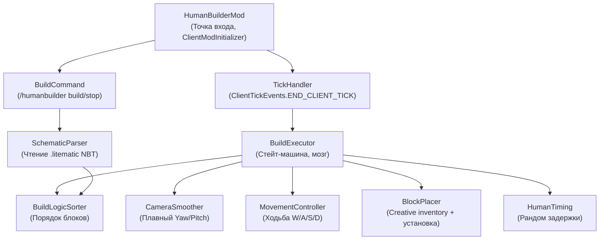

# HumanBuilder — Полное описание проекта

## Что это?

**HumanBuilder** — клиентский Fabric мод для Minecraft 1.21.x (Java 21), который автоматически строит структуры из `.litematic` / `.schematic` файлов. Главная фишка: строительство выглядит так, **как будто это делает настоящий человек**, а не бот. Это достигается за счёт плавных поворотов камеры, логичного порядка кладки и рандомизированных пауз.

> [!IMPORTANT]
> Мод работает **только в Creative Mode**. Блоки автоматически берутся из креативного инвентаря — никакой необходимости запасать ресурсы.

---

## Зачем?

Чтобы записать красивое видео (например, через Replay Mod), где персонаж строит дом «своими руками». Со стороны это выглядит как таймлапс реального строительства, но на деле всё автоматизировано.

---

## Как пользователь запускает мод

1. Заходит в мир (Creative Mode).
2. Кладёт `.litematic` файл в нужную папку (или указывает путь).
3. Вводит команду в чат:
   ```
   /humanbuilder build <файл.litematic>
   ```
4. Персонаж **сам** начинает строить: ходит, поворачивается, берёт блоки из креативного инвентаря, ставит их. Игрок просто наблюдает.
5. Чтобы остановить: `/humanbuilder stop`.

---

## Как работает «под капотом» — пошагово

### Шаг 1: Парсинг схемы (`SchematicParser`)

Пользователь ввёл `/humanbuilder build house.litematic`. Мод:

1. Читает `.litematic` файл (NBT-формат, bit-packed палитры блоков).
2. Преобразует его в `Map<BlockPos, BlockState>` — словарь «координата → блок».
   - Например: `(10, 64, 20) → oak_planks[axis=y]`
3. Воздух (`AIR`) отфильтровывается — строим только реальные блоки.

### Шаг 2: Сортировка блоков (`BuildLogicSorter`)

Полученный «сырой» словарь нужно упорядочить. Человек не ставит блоки хаотично — он строит **логично**. Мод сортирует блоки в очередь:

| Приоритет | Категория | Что входит |
|-----------|-----------|------------|
| 1 | **Фундамент** | Нижний слой (Y == minY). Спираль от угла. |
| 2 | **Стены** | Блоки на границах X/Z. Группировка по линиям. |
| 3 | **Перегородки** | Внутренние стены между комнатами. |
| 4 | **Полы/Лестницы** | Заполнение этажей. |
| 5 | **Крыша** | Верхний слой, слэбы, ступени. |
| 6 | **Декор** | Факелы, стёкла, двери, ковры. |

**Внутри каждой категории** — блоки сортируются по **Wall-Following** (nearest-neighbor):
- Берём ближайший блок к текущей позиции игрока.
- От него «ведём» линию вдоль стены (соседний блок по X или Z).
- Результат: стена выкладывается слева-направо, а не вразнобой.

Результат: упорядоченный `List<BuildEntry>` — очередь строительства.

### Шаг 3: Стейт-машина (`BuildExecutor`)

Это «мозг» мода. Каждый тик (50 мс) проверяет текущее состояние и решает, что делать:

```
IDLE → SORTING → WALKING → LOOKING → PLACING → WAITING → WALKING → ...
                                                    ↓
                                                 MISTAKE (1.5% шанс)
```

Подробно:

| Состояние | Что происходит |
|-----------|---------------|
| `IDLE` | Ничего не делаем, ждём команду `/build`. |
| `SORTING` | Парсим схему, сортируем блоки. Переходим в `WALKING`. |
| `WALKING` | Идём к следующему блоку из очереди. Когда подошли — `LOOKING`. |
| `LOOKING` | Плавно поворачиваем камеру на целевой блок. Когда прицел сошёлся — `PLACING`. |
| `PLACING` | Берём нужный блок из креативного инвентаря, ставим его. Переходим в `WAITING`. |
| `WAITING` | Рандомная пауза (150–350 мс). Затем `WALKING` к следующему блоку. |
| `SCAFFOLDING` | Нужно подняться — строим столбик блоков под собой. |
| `MISTAKE` | С шансом 1.5% «ошибаемся» — ломаем блок и ставим заново. |

Когда очередь пуста → `IDLE`. Строительство завершено.

### Шаг 4: Плавная камера (`CameraSmoother`)

Самый важный компонент для реализма. Когда мод решает посмотреть на блок:

1. Вычисляет целевые `targetYaw` и `targetPitch` (куда нужно смотреть).
2. **Каждый тик** интерполирует текущий угол к целевому через **Critically Damped Spring**:
   ```
   velocity += (target - current) * ω² * dt - 2 * ω * velocity * dt
   current += velocity * dt
   ```
   Это даёт **плавность с лёгким overshoot** — как когда человек двигает мышку и чуть-чуть промахивается мимо цели, потом корректирует.

3. Добавляет **микро-шум** (±0.15°) — имитация тремора руки.
4. Возвращает `isConverged() = true`, когда прицел в пределах 1° от цели.

**Параметры:**
- Полный поворот на 90° ≈ 400 мс (8 тиков)
- Тремор: ±0.1–0.3° каждый тик
- Overshoot: 5–12% — лёгкий перелёт мимо цели

### Шаг 5: Установка блоков (`BlockPlacer`)

Когда камера сошлась на цели:

1. **Поиск блока в хотбаре:** Проверяем слоты 0–8 — есть ли нужный `ItemStack`?
2. **Если нет → берём из креативного инвентаря:** Используем `interactionManager.clickCreativeStack(itemStack, slotId)` чтобы положить блок в текущий слот хотбара.
3. **Пауза 2–4 тика** — имитация «человек ищет блок».
4. **Установка:** `interactionManager.interactBlock(...)` с правильным `BlockHitResult` (сторона блока, точка попадания).

### Шаг 6: Движение (`MovementController`)

Чтобы подойти к нужному блоку:

1. Вычисляет направление к целевой позиции (в пределах reach distance ≈ 4.5 блока).
2. Симулирует нажатие клавиш `W/A/S/D` через `options.forwardKey` и т.д.
3. Если нужно подняться — `options.jumpKey` или строительство «лесов» (столбик блоков).

### Шаг 7: Тайминги (`HumanTiming`)

Все задержки рандомизированы для естественности:

| Действие | Задержка | ~Мс |
|----------|----------|-----|
| Между блоками (одна стена) | 3–7 тиков | 150–350 мс |
| Переход к новой стене | 10–20 тиков | 500–1000 мс |
| Переход на новый этаж | 20–40 тиков | 1–2 сек |
| «Задумался» (5% шанс) | 15–30 тиков | 0.75–1.5 сек |
| Ошибка + исправление (1.5%) | 20–40 тиков | 1–2 сек |

---

## Архитектура — кто кого вызывает



**Поток данных:**
1. `BuildCommand` получает команду → вызывает `SchematicParser` → передаёт `Map<BlockPos, BlockState>` в `BuildLogicSorter`.
2. `BuildLogicSorter` сортирует → возвращает `List<BuildEntry>` в `BuildExecutor`.
3. Каждый тик `TickHandler` вызывает `BuildExecutor.tick()`.
4. `BuildExecutor` в зависимости от состояния дёргает `MovementController`, `CameraSmoother`, `BlockPlacer`, `HumanTiming`.

---

## Структура файлов проекта

```
human-builder/
├── build.gradle                    # Зависимости (Fabric API)
├── gradle.properties               # Версии MC, Fabric, мода
├── settings.gradle
└── src/main/
    ├── java/com/humanbuilder/
    │   ├── HumanBuilderMod.java          # Точка входа (ClientModInitializer)
    │   ├── TickHandler.java              # END_CLIENT_TICK → tick() всех модулей
    │   ├── command/
    │   │   └── BuildCommand.java         # /humanbuilder build|stop
    │   ├── camera/
    │   │   └── CameraSmoother.java       # ✅ Готов — Critically Damped Spring
    │   ├── logic/
    │   │   ├── BlockCategory.java        # ✅ Готов — Enum категорий
    │   │   ├── BuildEntry.java           # ✅ Готов — Record (pos, state, category)
    │   │   └── BuildLogicSorter.java     # ✅ Готов — Приоритизация + wall-following
    │   ├── executor/
    │   │   ├── BuildState.java           # ✅ Готов — Enum состояний стейт-машины
    │   │   └── BuildExecutor.java        # Стейт-машина
    │   ├── movement/
    │   │   └── MovementController.java   # Ходьба, прыжки, леса
    │   ├── placer/
    │   │   └── BlockPlacer.java          # Creative inventory + interactBlock
    │   ├── timing/
    │   │   └── HumanTiming.java          # ✅ Готов — Рандом задержки
    │   └── parser/
    │       └── SchematicParser.java       # NBT → Map<BlockPos, BlockState>
    └── resources/
        └── fabric.mod.json               # ✅ Готов — Метаданные мода
```

**Статус:** 6 из ~12 файлов готовы.

---

## Ключевые принципы

1. **Только клиентская сторона** — мод не трогает сервер, всё через `MinecraftClient.getInstance()`.
2. **Только Creative Mode** — блоки берутся из креативного инвентаря через `clickCreativeStack()`.
3. **Реализм превыше скорости** — цель не быстро построить, а чтобы со стороны (на видео) выглядело как живой человек.
4. **Всё через тики** — каждое действие происходит по `ClientTickEvents`, никаких отдельных потоков.
5. **Нет прямого setBlock** — мод не телепортирует блоки. Он симулирует реальное взаимодействие: подходит, поворачивается, ставит через `interactBlock`.
